# [📈 Live Status](https://status.levonk.com): <!--live status--> **🟩 All systems operational**

This repository contains the open-source uptime monitor and status page for [levonk](https://patreon.com/levonk), powered by [Upptime](https://github.com/upptime/upptime).

With [Upptime](https://upptime.js.org), you can get your own unlimited and free uptime monitor and status page, powered entirely by a GitHub repository. We use [Issues](https://github.com/levonk/status/issues) as incident reports, [Actions](https://github.com/levonk/status/actions) as uptime monitors, and [Pages](https://status.levonk.com) for the status page.

<!--start: status pages-->
<!-- This summary is generated by Upptime (https://github.com/upptime/upptime) -->
<!-- Do not edit this manually, your changes will be overwritten -->
<!-- prettier-ignore -->
| URL | Status | History | Response Time | Uptime |
| --- | ------ | ------- | ------------- | ------ |
|  [Devin API](https://api.devin.ai/v1/health) | 🟩 Up | [devin-api.yml](https://github.com/levonk/status/commits/HEAD/history/devin-api.yml) | 

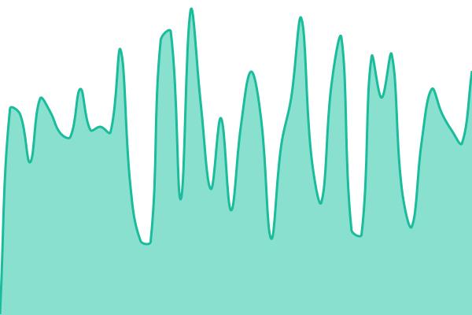 302ms
     
 | 

<a href="https://levonk.github.io/status/history/devin-api">100.00%</a>
    

|  [OpenRouter API](https://openrouter.ai/api/v1/models) | 🟩 Up | [open-router-api.yml](https://github.com/levonk/status/commits/HEAD/history/open-router-api.yml) | 

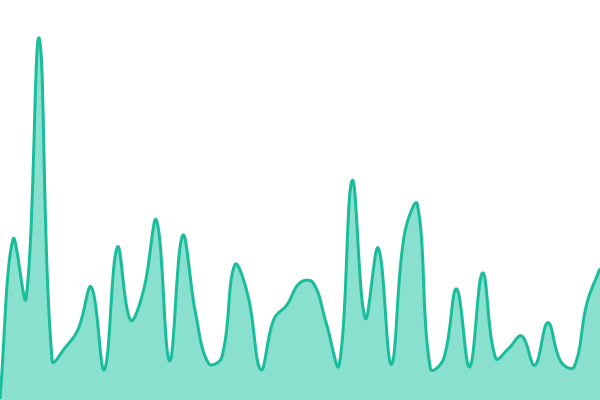 89ms
     
 | 

<a href="https://levonk.github.io/status/history/open-router-api">100.00%</a>
    

|  [OpenAI API](https://api.openai.com/v1/models) | 🟩 Up | [open-ai-api.yml](https://github.com/levonk/status/commits/HEAD/history/open-ai-api.yml) | 

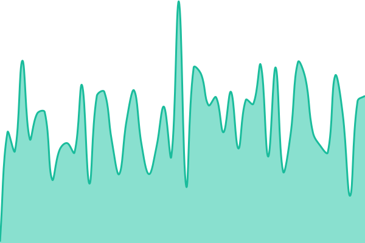 93ms
     
 | 

<a href="https://levonk.github.io/status/history/open-ai-api">100.00%</a>
    

|  [Moonshot API](https://api.moonshot.cn/v1/models) | 🟩 Up | [moonshot-api.yml](https://github.com/levonk/status/commits/HEAD/history/moonshot-api.yml) | 

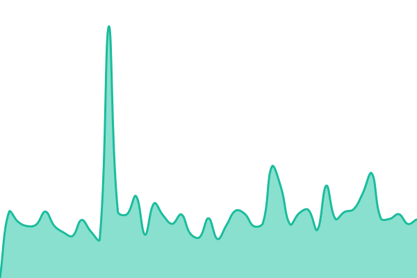 1414ms
     
 | 

<a href="https://levonk.github.io/status/history/moonshot-api">100.00%</a>
    

|  [Z.ai API](https://api.z.ai/api/v1/models) | 🟩 Up | [z-ai-api.yml](https://github.com/levonk/status/commits/HEAD/history/z-ai-api.yml) | 

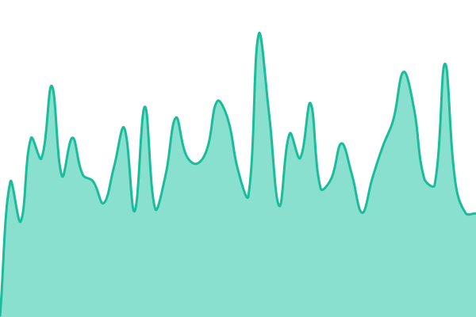 609ms
     
 | 

<a href="https://levonk.github.io/status/history/z-ai-api">100.00%</a>
    

|  [DeepSeek API](https://api.deepseek.com/v1/models) | 🟩 Up | [deep-seek-api.yml](https://github.com/levonk/status/commits/HEAD/history/deep-seek-api.yml) | 

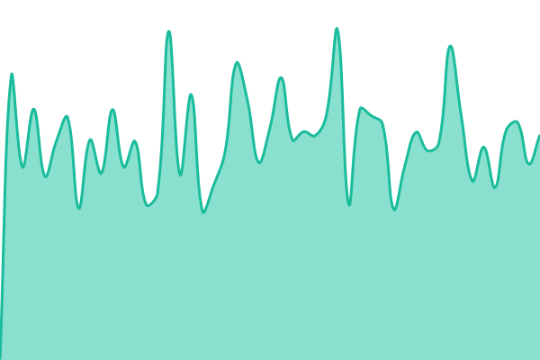 447ms
     
 | 

<a href="https://levonk.github.io/status/history/deep-seek-api">100.00%</a>
    

|  [Meta AI API (Llama)](https://api.llama.com/v1/models) | 🟩 Up | [meta-ai-api-llama.yml](https://github.com/levonk/status/commits/HEAD/history/meta-ai-api-llama.yml) | 

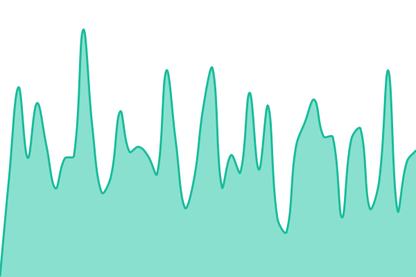 243ms
     
 | 

<a href="https://levonk.github.io/status/history/meta-ai-api-llama">100.00%</a>
    

|  [Oracle Cloud](https://cloud.oracle.com) | 🟩 Up | [oracle-cloud.yml](https://github.com/levonk/status/commits/HEAD/history/oracle-cloud.yml) | 

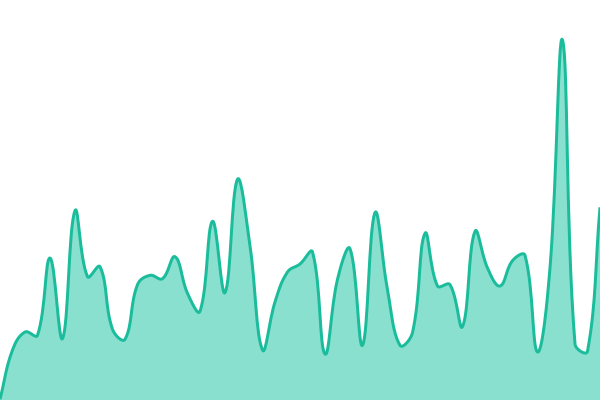 201ms
     
 | 

<a href="https://levonk.github.io/status/history/oracle-cloud">100.00%</a>
    

|  [Amazon Web Services](https://aws.amazon.com) | 🟩 Up | [amazon-web-services.yml](https://github.com/levonk/status/commits/HEAD/history/amazon-web-services.yml) | 

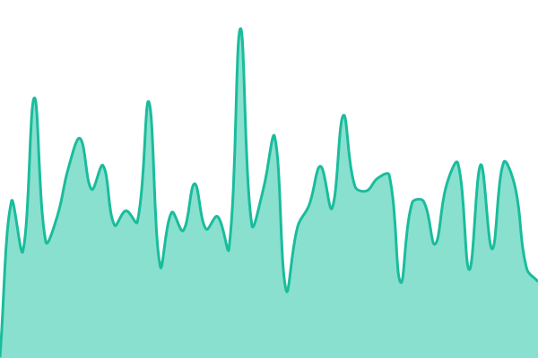 208ms
     
 | 

<a href="https://levonk.github.io/status/history/amazon-web-services">100.00%</a>
    

|  [Google Cloud](https://cloud.google.com) | 🟩 Up | [google-cloud.yml](https://github.com/levonk/status/commits/HEAD/history/google-cloud.yml) | 

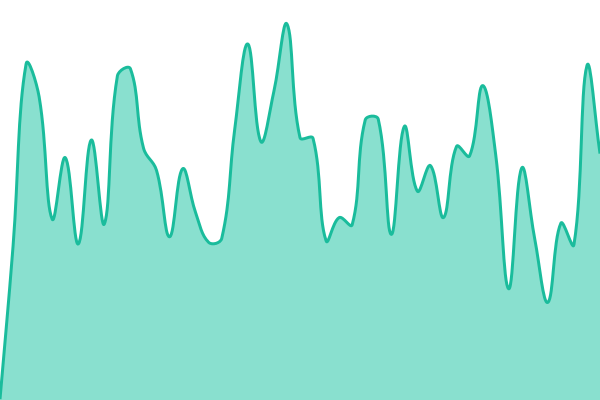 301ms
     
 | 

<a href="https://levonk.github.io/status/history/google-cloud">100.00%</a>
    

|  [Microsoft Azure](https://azure.microsoft.com) | 🟩 Up | [microsoft-azure.yml](https://github.com/levonk/status/commits/HEAD/history/microsoft-azure.yml) | 

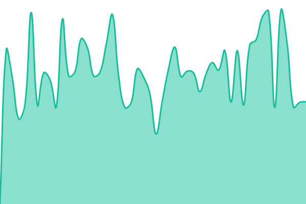 4500ms
     
 | 

<a href="https://levonk.github.io/status/history/microsoft-azure">100.00%</a>
    

|  [Google DNS (8.8.8.8)](https://dns.google/resolve?name=levonk.com&type=A) | 🟩 Up | [google-dns-8-8-8-8.yml](https://github.com/levonk/status/commits/HEAD/history/google-dns-8-8-8-8.yml) | 

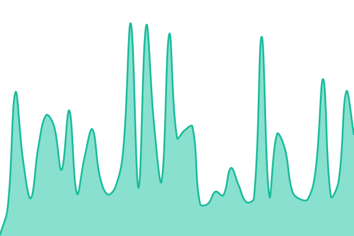 76ms
     
 | 

<a href="https://levonk.github.io/status/history/google-dns-8-8-8-8">100.00%</a>
    

|  [Cloudflare DNS (1.1.1.1)](https://cloudflare-dns.com/dns-query?name=levonk.com&type=A) | 🟩 Up | [cloudflare-dns-1-1-1-1.yml](https://github.com/levonk/status/commits/HEAD/history/cloudflare-dns-1-1-1-1.yml) | 

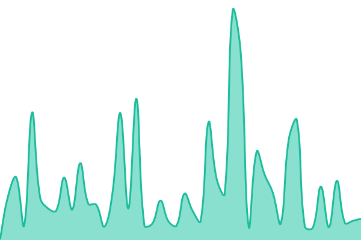 79ms
     
 | 

<a href="https://levonk.github.io/status/history/cloudflare-dns-1-1-1-1">100.00%</a>
    

|  [Cloudflare API](https://api.cloudflare.com/client/v4/user/tokens/verify) | 🟩 Up | [cloudflare-api.yml](https://github.com/levonk/status/commits/HEAD/history/cloudflare-api.yml) | 

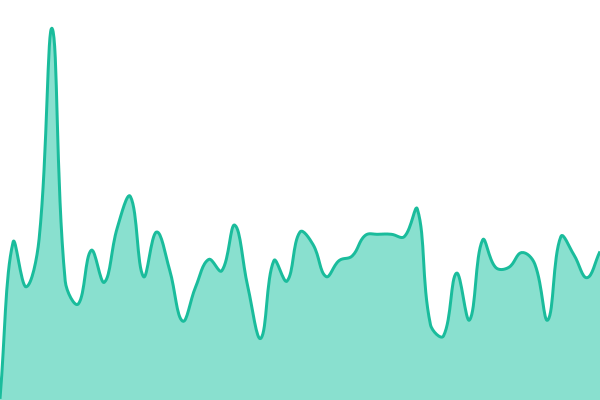 125ms
     
 | 

<a href="https://levonk.github.io/status/history/cloudflare-api">100.00%</a>
    

|  [X (Twitter)](https://x.com) | 🟩 Up | [x-twitter.yml](https://github.com/levonk/status/commits/HEAD/history/x-twitter.yml) | 

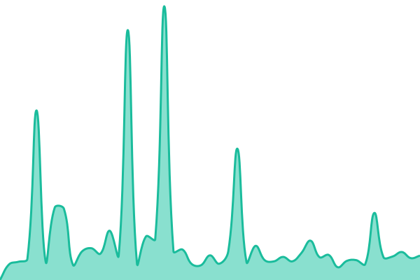 165ms
     
 | 

<a href="https://levonk.github.io/status/history/x-twitter">100.00%</a>
    

|  [YouTube](https://www.youtube.com) | 🟩 Up | [you-tube.yml](https://github.com/levonk/status/commits/HEAD/history/you-tube.yml) | 

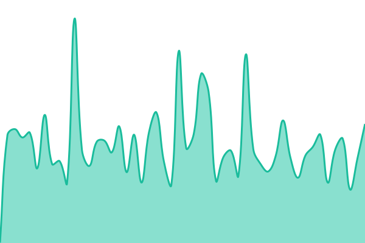 298ms
     
 | 

<a href="https://levonk.github.io/status/history/you-tube">100.00%</a>
    

|  [Instagram](https://www.instagram.com) | 🟩 Up | [instagram.yml](https://github.com/levonk/status/commits/HEAD/history/instagram.yml) | 

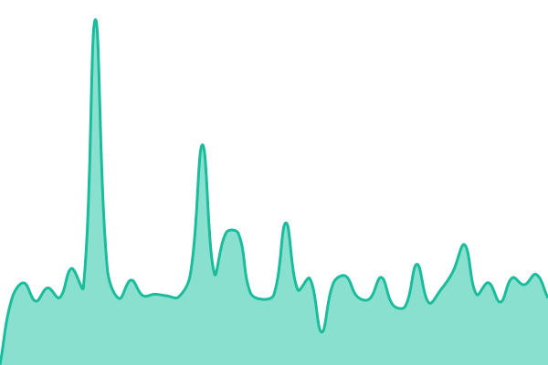 546ms
     
 | 

<a href="https://levonk.github.io/status/history/instagram">100.00%</a>
    

|  [Telegram](https://telegram.org) | 🟩 Up | [telegram.yml](https://github.com/levonk/status/commits/HEAD/history/telegram.yml) | 

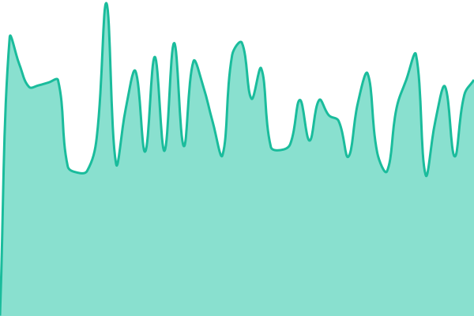 634ms
     
 | 

<a href="https://levonk.github.io/status/history/telegram">100.00%</a>
    

|  [Telegram Bot API](https://api.telegram.org) | 🟩 Up | [telegram-bot-api.yml](https://github.com/levonk/status/commits/HEAD/history/telegram-bot-api.yml) | 

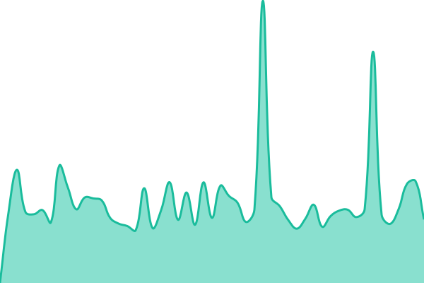 1076ms
     
 | 

<a href="https://levonk.github.io/status/history/telegram-bot-api">100.00%</a>
    

|  [Discord](https://discord.com/api/v10/gateway) | 🟩 Up | [discord.yml](https://github.com/levonk/status/commits/HEAD/history/discord.yml) | 

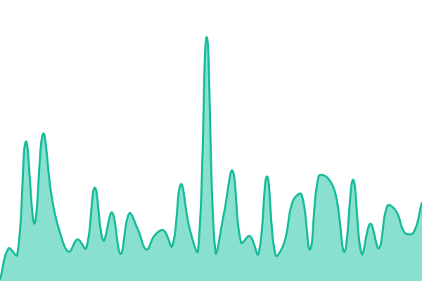 53ms
     
 | 

<a href="https://levonk.github.io/status/history/discord">100.00%</a>
    

|  [TikTok](https://www.tiktok.com) | 🟩 Up | [tik-tok.yml](https://github.com/levonk/status/commits/HEAD/history/tik-tok.yml) | 

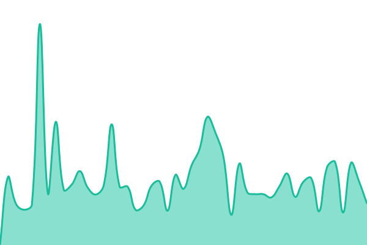 488ms
     
 | 

<a href="https://levonk.github.io/status/history/tik-tok">100.00%</a>
    

|  [Google Drive](https://drive.google.com) | 🟩 Up | [google-drive.yml](https://github.com/levonk/status/commits/HEAD/history/google-drive.yml) | 

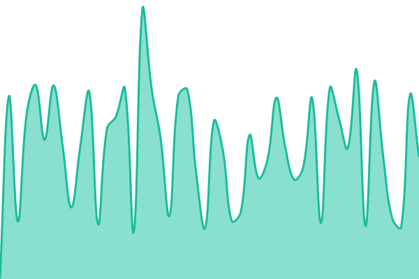 393ms
     
 | 

<a href="https://levonk.github.io/status/history/google-drive">100.00%</a>
    

|  [Gmail](https://www.google.com/gmail/about/) | 🟩 Up | [gmail.yml](https://github.com/levonk/status/commits/HEAD/history/gmail.yml) | 

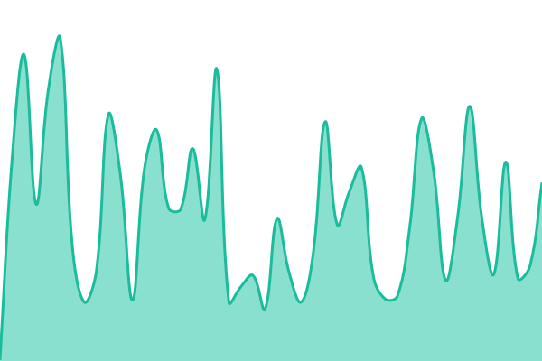 138ms
     
 | 

<a href="https://levonk.github.io/status/history/gmail">100.00%</a>
    

|  [Google Voice](https://voice.google.com) | 🟩 Up | [google-voice.yml](https://github.com/levonk/status/commits/HEAD/history/google-voice.yml) | 

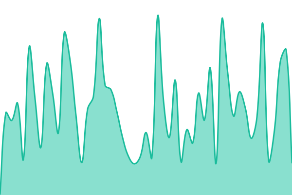 195ms
     
 | 

<a href="https://levonk.github.io/status/history/google-voice">100.00%</a>
    

|  [Google Sheets](https://www.google.com/sheets/about/) | 🟩 Up | [google-sheets.yml](https://github.com/levonk/status/commits/HEAD/history/google-sheets.yml) | 

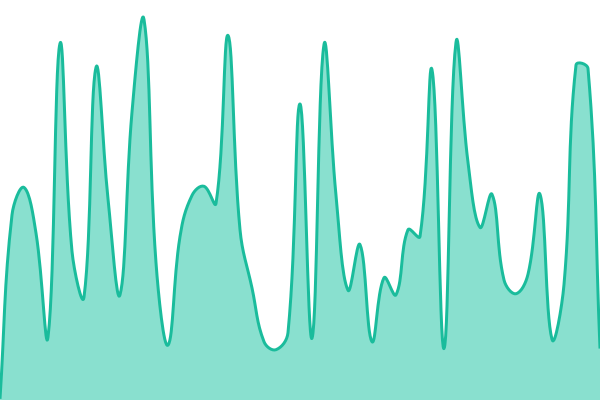 151ms
     
 | 

<a href="https://levonk.github.io/status/history/google-sheets">100.00%</a>
    

|  [Google Docs](https://docs.google.com) | 🟩 Up | [google-docs.yml](https://github.com/levonk/status/commits/HEAD/history/google-docs.yml) | 

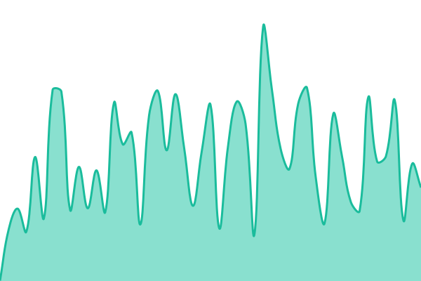 385ms
     
 | 

<a href="https://levonk.github.io/status/history/google-docs">100.00%</a>
    

|  [Google Workspace](https://workspace.google.com) | 🟩 Up | [google-workspace.yml](https://github.com/levonk/status/commits/HEAD/history/google-workspace.yml) | 

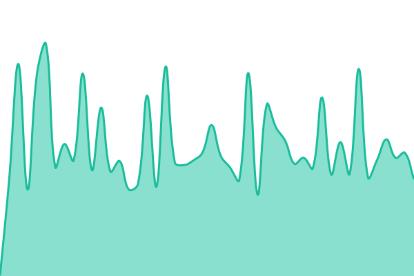 277ms
     
 | 

<a href="https://levonk.github.io/status/history/google-workspace">100.00%</a>
    

|  [LiveKit Cloud](https://cloud.livekit.io) | 🟩 Up | [live-kit-cloud.yml](https://github.com/levonk/status/commits/HEAD/history/live-kit-cloud.yml) | 

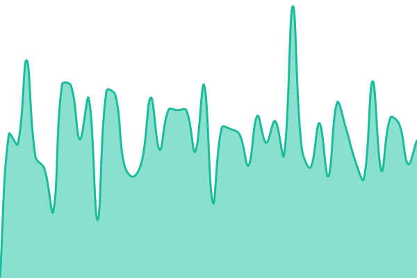 520ms
     
 | 

<a href="https://levonk.github.io/status/history/live-kit-cloud">100.00%</a>
    

|  [n8n Cloud](https://n8n.cloud) | 🟩 Up | [n8n-cloud.yml](https://github.com/levonk/status/commits/HEAD/history/n8n-cloud.yml) | 

 395ms
     
 | 

<a href="https://levonk.github.io/status/history/n8n-cloud">100.00%</a>
    

|  [GoHighLevel](https://app.gohighlevel.com) | 🟩 Up | [go-high-level.yml](https://github.com/levonk/status/commits/HEAD/history/go-high-level.yml) | 

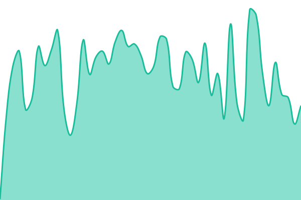 154ms
     
 | 

<a href="https://levonk.github.io/status/history/go-high-level">100.00%</a>
    

<!--end: status pages-->

[**Visit our status website →**](https://status.levonk.com)

## 📄 License

- Powered by: [Upptime](https://github.com/upptime/upptime)
- Code: [MIT](./LICENSE) © [Anand Chowdhary](https://anandchowdhary.com)
- Data in the `./history` directory: [Open Database License](https://opendatacommons.org/licenses/odbl/1-0/)
